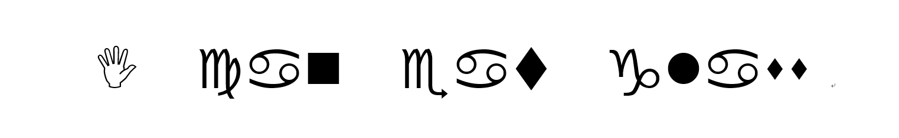

# 一份解密游戏攻略

writen by 游戏体验终结者  

游戏网址:[謎.Games](https://nazo.games/)

# level1:A+B problem----简单
>1+1=?

<i><b>解题思路:</b></i>  
这题目好哲学啊,,不会(溜....

# level2:初中数学----简单(gepi)
>5!=5*4*3*2*1=120  
12 mod 10=2  
5^3 = 5*5*5  
(233!) mod 1009 = a  
(72^321) mod 1009 = b  
a-b=430

<i><b>解题思路:</b></i>  
初中题,我也不会(溜...

# level3:什么东西不对----简单

>好像有什么东西不对……是什么呢？

<i><b>解题思路:</b></i>  
```javascript
<title> Level 1: answer is violet </title>
```
标题:我是不会告诉你答案的  
我:(雾....

# level4:颜色填空

>Roses -> red  
Violets -> ____

<i><b>解题思路:</b></i>  
一首英国童谣献给大家:
>[《Roses are Red》](https://en.wikipedia.org/wiki/Roses_Are_Red)   
Roses are red,  
Violets are blue,  
sugar is sweet,  
And so are you.

# level5:答案已知----前端

>这题的答案就是"答案"，简单吧  

<i><b>解题思路:</b></i>  
都有答案了,提交答案呗.  
什么,你说找不到提交??  
都说了有关前端了,  
f12看一下,知道提交按钮是提交表单的,  
fiddle抓包,ajax,想怎么弄都可以--逼格秒高  
什么,你说你都不会?  
那你还是去找度娘吧

# level6:找规律

>0, 0, 1, 1, 0, 0, 3, 0, 18, 143, ___

<i><b>解题思路:</b></i>  
发动数学思维吧!!  
找不出规律??  
其实我也找不到....  
暴力出答案...  


# level7:Encoded----密码

>MyAxNSAxNCA3IDE4IDEgMjA=

<i><b>解题思路:</b></i>  
[BASE64加密](http://tool.chinaz.com/Tools/Base64.aspx)了解一下  
得到一组数字,
emm...都小于26  
换成英文...获得密码一份  
Congratulations!(逃...

# level8:虚无之关----前端

这关怎么是首页a??  
等等,好像看到有字啊,,  
stop看看  
题目一片空白.....   
f12看看,,,(逃

# level9:反马赛克技术


既然要反马赛克,那就一定要保存先  
Then,发现图片变成了这样


英文单词鉴定完毕,不是答案,
那么,被圣光照耀的剩下的一定就是答案了(✿◡‿◡)..  
emm,,但四我不会反马赛克啊,,,  

度娘:这是一个景点的观光火车,,牌号365  
我:惹不起,惹不起(逃...

# level10:反hash函数

>e650bada4835b7c8da026556de0c595c

传说被hash加密后无法恢复....  
有一个方法叫
[查库](http://www.chamd5.org/)(逃....

# level11:数据恢复大师----git

>当版本管理系统遇到了数据删除…  
[下载附件](https://nazo.games/files/git.zip)

[科普一下...](https://www.jianshu.com/p/918f950fbd58)(buff:假装我很懂)

# level12:字母表

>LEE-MAH IN-DEE-AH NO-VEM-BER __________ ECKS-RAY

[北约音标字母表](https://wenku.baidu.com/view/7c0217821711cc7930b7160a.html)

# level13:ﾟωﾟﾉ

>ﾟωﾟﾉ= /｀ｍ´）ﾉ ~┻━┻ //*´∇｀*/ ['_']; o=(ﾟｰﾟ) =_=3; c=(ﾟΘﾟ) =(ﾟｰﾟ)-(ﾟｰﾟ); (ﾟДﾟ) =(ﾟΘﾟ)= (o^_^o)/ (o^_^o);(ﾟДﾟ)={ﾟΘﾟ: '_' ,ﾟωﾟﾉ : ((ﾟωﾟﾉ==3) +'_') [ﾟΘﾟ] ,ﾟｰﾟﾉ :(ﾟωﾟﾉ+ '_')[o^_^o -(ﾟΘﾟ)] ,ﾟДﾟﾉ:((ﾟｰﾟ==3) +'_')[ﾟｰﾟ] }; (ﾟДﾟ) [ﾟΘﾟ] =((ﾟωﾟﾉ==3) +'_') [c^_^o];(ﾟДﾟ) ['c'] = ((ﾟДﾟ)+'_') [ (ﾟｰﾟ)+(ﾟｰﾟ)-(ﾟΘﾟ) ];(ﾟДﾟ) ['o'] = ((ﾟДﾟ)+'_') [ﾟΘﾟ];(ﾟoﾟ)=(ﾟДﾟ) ['c']+(ﾟДﾟ) ['o']+(ﾟωﾟﾉ +'_')[ﾟΘﾟ]+ ((ﾟωﾟﾉ==3) +'_') [ﾟｰﾟ] + ((ﾟДﾟ) +'_') [(ﾟｰﾟ)+(ﾟｰﾟ)]+ ((ﾟｰﾟ==3) +'_') [ﾟΘﾟ]+((ﾟｰﾟ==3) +'_') [(ﾟｰﾟ) - (ﾟΘﾟ)]+(ﾟДﾟ) ['c']+((ﾟДﾟ)+'_') [(ﾟｰﾟ)+(ﾟｰﾟ)]+ (ﾟДﾟ) ['o']+((ﾟｰﾟ==3) +'_') [ﾟΘﾟ];(ﾟДﾟ) ['_'] =(o^_^o) [ﾟoﾟ] [ﾟoﾟ];(ﾟεﾟ)=((ﾟｰﾟ==3) +'_') [ﾟΘﾟ]+ (ﾟДﾟ) .ﾟДﾟﾉ+((ﾟДﾟ)+'_') [(ﾟｰﾟ) + (ﾟｰﾟ)]+((ﾟｰﾟ==3) +'_') [o^_^o -ﾟΘﾟ]+((ﾟｰﾟ==3) +'_') [ﾟΘﾟ]+ (ﾟωﾟﾉ +'_') [ﾟΘﾟ]; (ﾟｰﾟ)+=(ﾟΘﾟ); (ﾟДﾟ)[ﾟεﾟ]='\\'; (ﾟДﾟ).ﾟΘﾟﾉ=(ﾟДﾟ+ ﾟｰﾟ)[o^_^o -(ﾟΘﾟ)];(oﾟｰﾟo)=(ﾟωﾟﾉ +'_')[c^_^o];(ﾟДﾟ) [ﾟoﾟ]='\"';(ﾟДﾟ) ['_'] ( (ﾟДﾟ) ['_'] (ﾟεﾟ+(ﾟДﾟ)[ﾟoﾟ]+ (ﾟДﾟ)[ﾟεﾟ]+(ﾟΘﾟ)+ ((ﾟｰﾟ) + (ﾟΘﾟ))+ ((o^_^o) +(o^_^o))+ (ﾟДﾟ)[ﾟεﾟ]+(ﾟΘﾟ)+ (ﾟｰﾟ)+ (ﾟΘﾟ)+ (ﾟДﾟ)[ﾟεﾟ]+(ﾟΘﾟ)+ (ﾟｰﾟ)+ (ﾟΘﾟ)+ (ﾟДﾟ)[ﾟεﾟ]+(ﾟΘﾟ)+ (ﾟｰﾟ)+ (ﾟΘﾟ)+ (ﾟДﾟ)[ﾟεﾟ]+(ﾟΘﾟ)+ ((ﾟｰﾟ) + (o^_^o))+ ((o^_^o) - (ﾟΘﾟ))+ (ﾟДﾟ)[ﾟεﾟ]+(ﾟΘﾟ)+ ((ﾟｰﾟ) + (ﾟΘﾟ))+ ((ﾟｰﾟ) + (o^_^o))+ (ﾟДﾟ)[ﾟoﾟ]) (ﾟΘﾟ)) ('_');

表情包js加密法,[了解一下](http://utf-8.jp/public/aaencode.html)
# level14:Pi

>14159=1  
15926=3  
23333=?

[pi的小数大全](https://wenku.baidu.com/view/6d7a492ded630b1c59eeb597.html)
# level15:SMS----密码

>2937663

手机调成九键按按呗(逃.....
# level16:栅栏----密码

>YEETEPRCODCDDTHKYSAOAIUOIEINM


惯例:[科普一下...](https://baike.baidu.com/item/%E6%A0%85%E6%A0%8F%E5%AF%86%E7%A0%81/228209)  
[再来个tool](http://ctf.ssleye.com/railfence.html)

# level17:Dingbat Ornaments

>and __________

百度啊  
[tip](images/level17.jpg)

# level18:FAKE

>FAKE

条形码里的就是你吧(逃...

# level19:Philadelphia----密码
>6 37 42 42 12  
1776 Philadelphia

[线索1](https://baike.baidu.com/item/%E7%8B%AC%E7%AB%8B%E5%AE%A3%E8%A8%80/53146?fr=aladdin)  
[线索2](https://www.guokr.com/article/41372/?f=wx&page=2)  
累不累...hhh...(逃....

# level20:删除本关
>How do you delete this level in a restful world?

ajax一行搞定
`
$.ajax({type:"DELETE",url:"site"});
`  
不会用?  
去f12的console控制台敲进去回车  
没反应?  
密码已经发给你了啊!!  
研究一下f12里的network  
在header中,你会发现  
key:****

# level21:隐藏的信息
>答案已经顺着网线传输给你了…

研究一下f12里的network  
在header中,你会发现  
key:****

~~level22:~~

好吧,,后面的我也不会了,,(逃...
