先创建一个新的项目
------
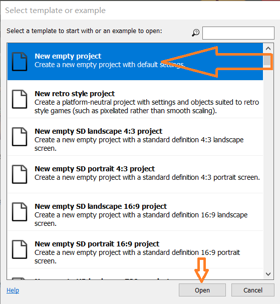
## 1，实现背景地面
1. 插入背景
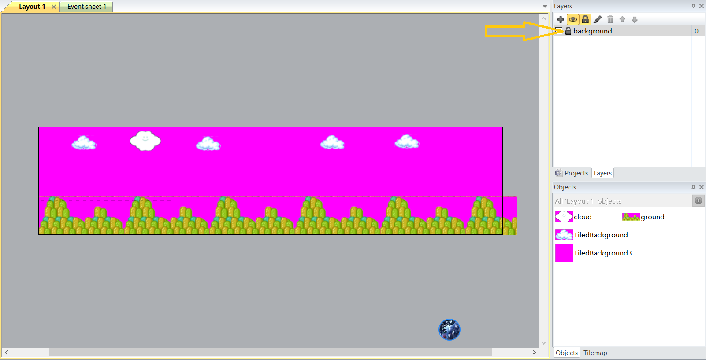
2. 新建图层,插入地面，设置solid属性
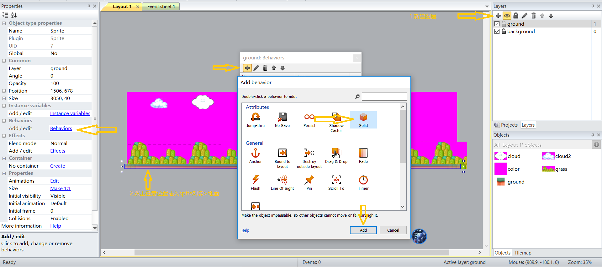

## 2，实现马里奥
1. 插入spite对象，  
打开找到的马里奥GIF，
分成站立姿势，行走姿势，蹲下姿势，
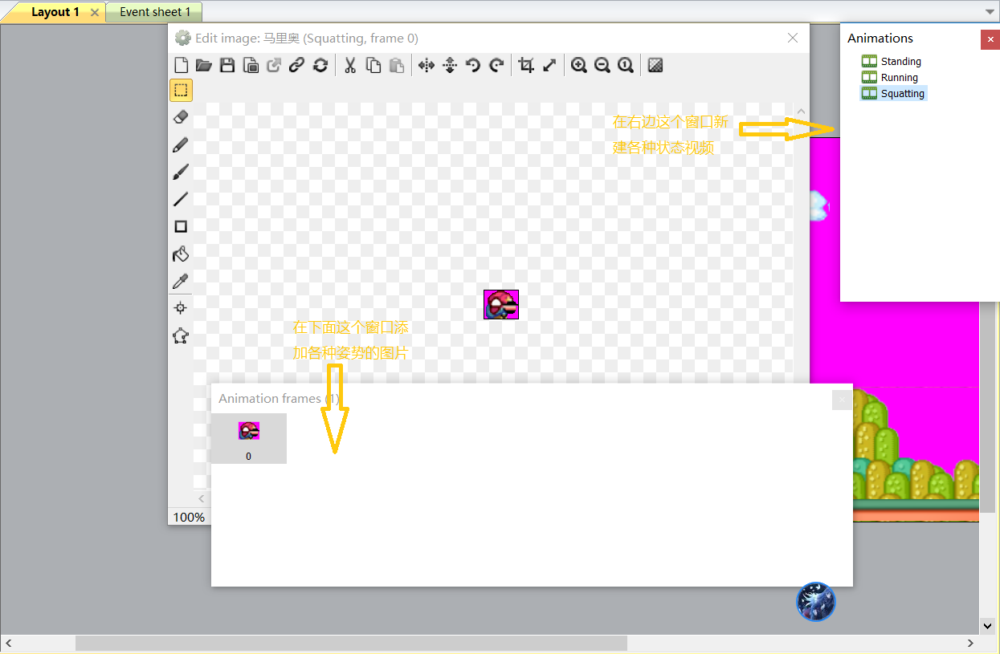
2. 设置属性
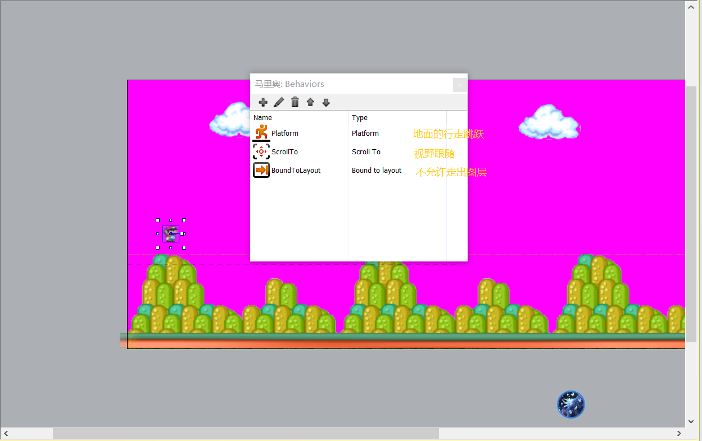

## 3，实现键盘控制
1. 双击插入keyboard对象，
2. 设置键盘控制的事件
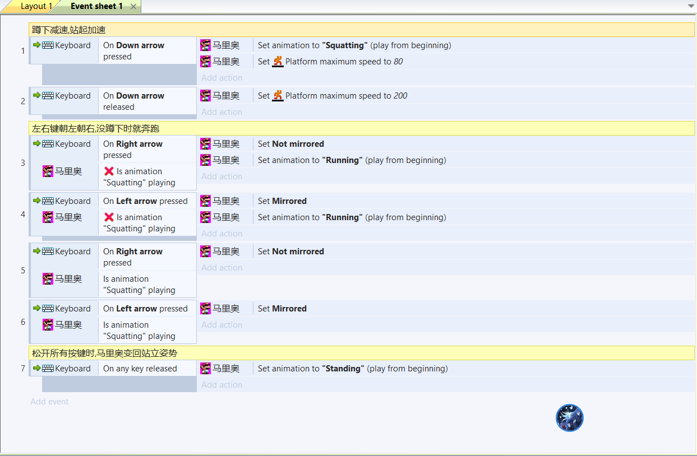

## 4，实现方块
1. 插入相关的对象
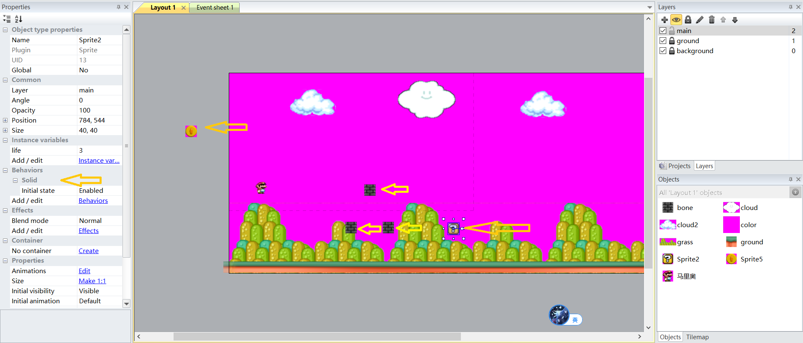
2. 设置方块的事件
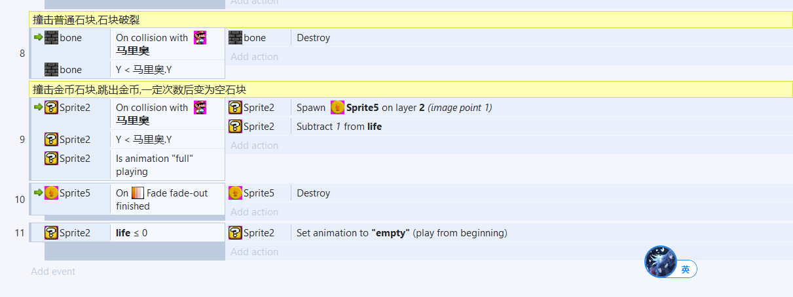

## 5，实现蘑菇怪
1. 放入蘑菇怪,设置往返行走
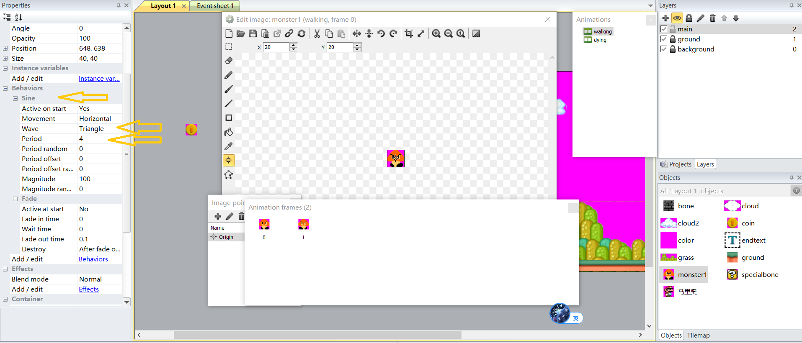
2. 设置马里奥从上面碰撞则怪物销毁，否则则马里奥销毁
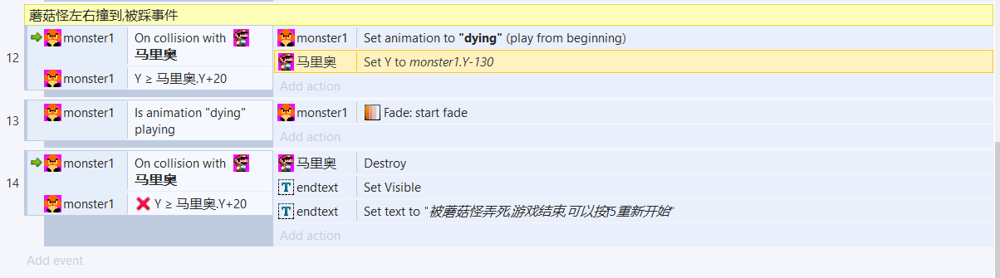

# 6，实现乌龟怪
1. 放入乌龟怪,设置来回行走，
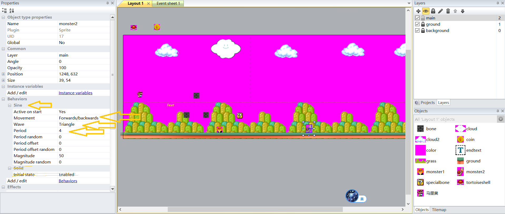
2. 设置乌龟的事件
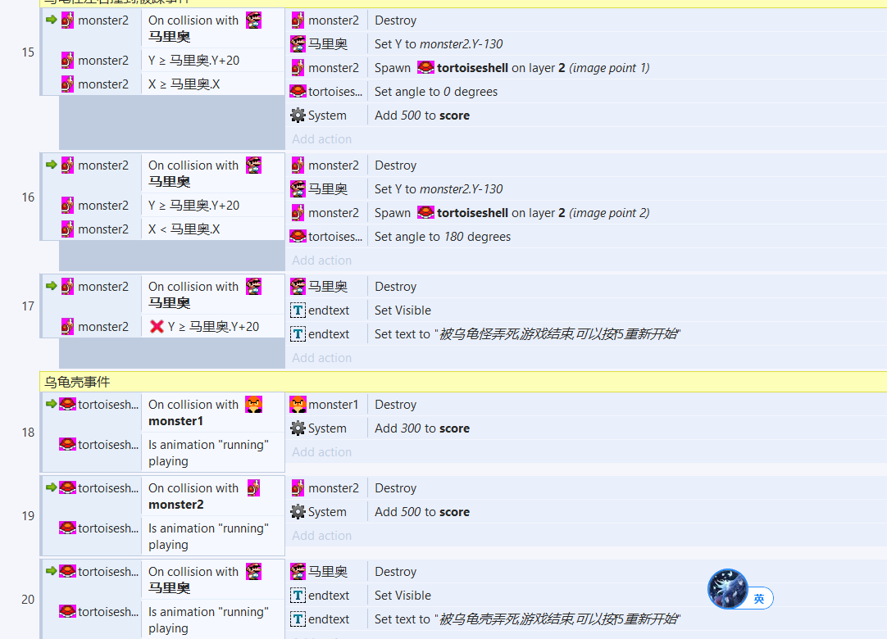

# 7，实现水管
1. 放入水管，设置solid
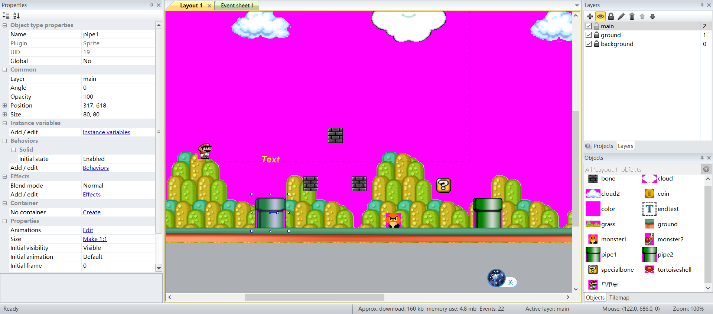
2. 添加事件:在水管上方按下下方向键时，马里奥坐标转移
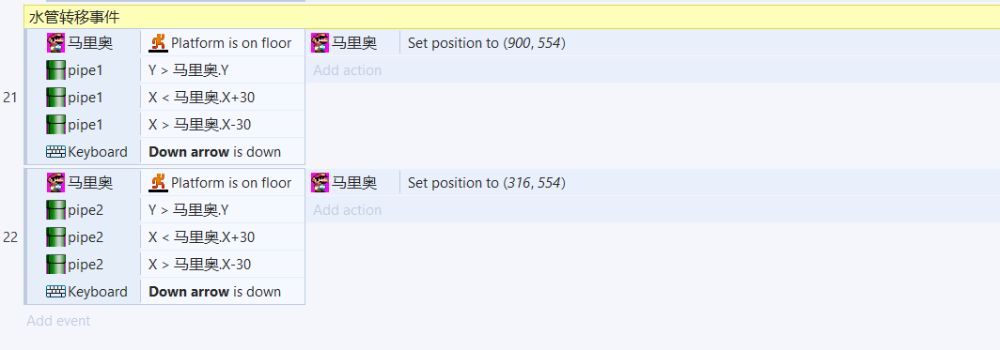

# 8，实现分数显示
1. 新建UI图层,设置Scale rate和Parallax属性都为0以固定位置
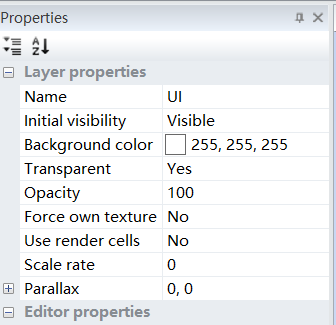
2. 新建全局变量
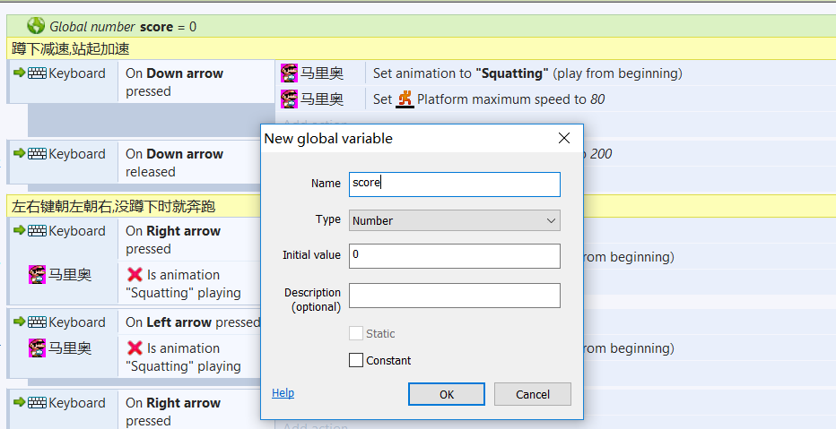
3. 加分事件
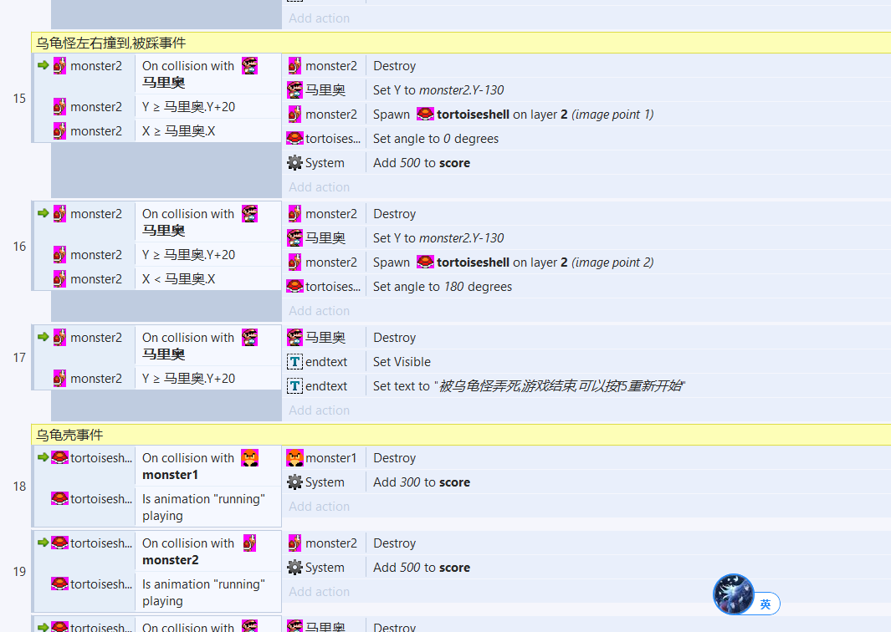
4. 设置text来显示分数
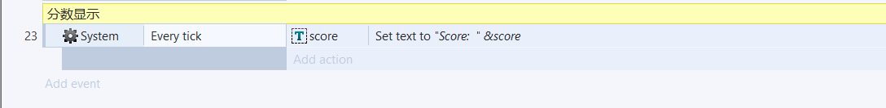

测试了一下,愉快的玩耍...
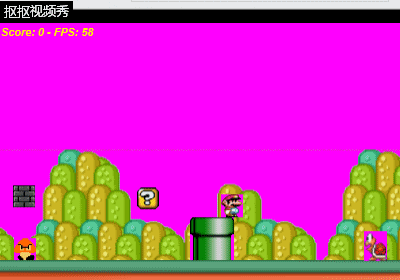
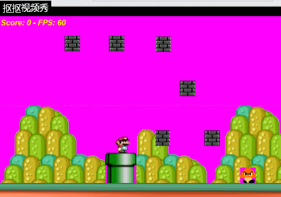